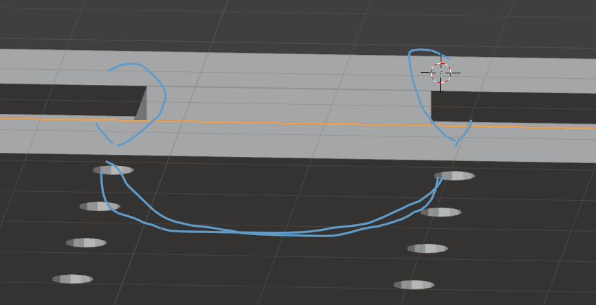
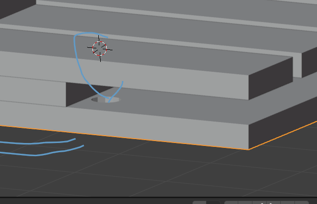
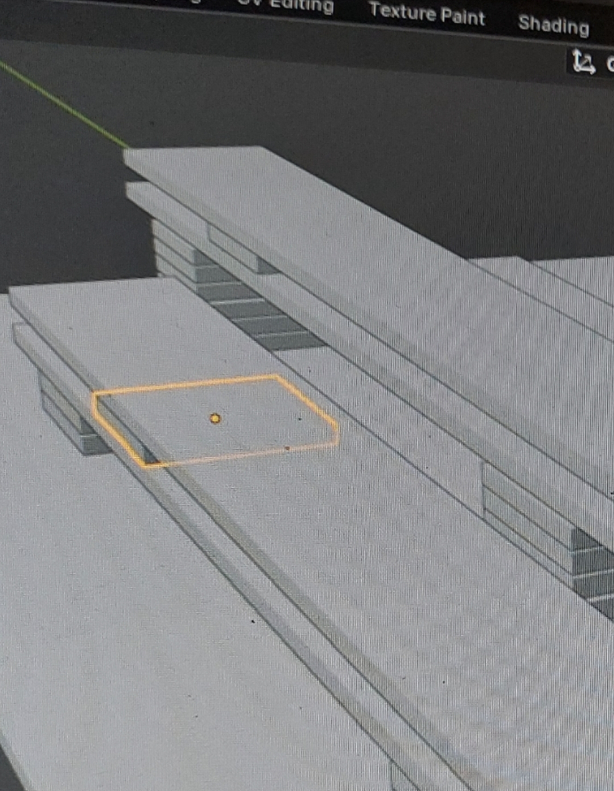
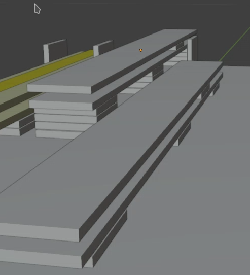
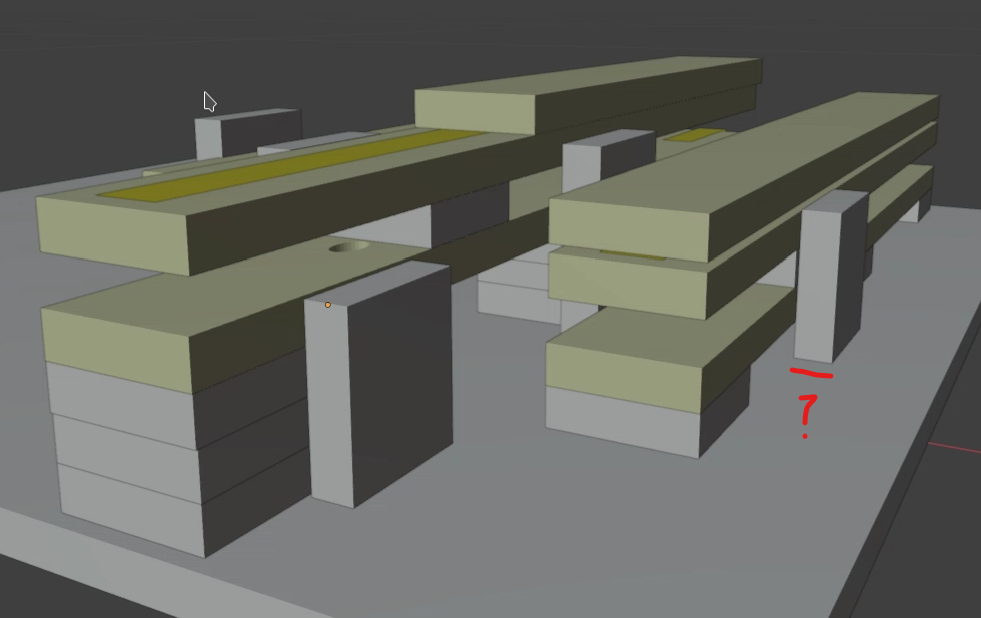
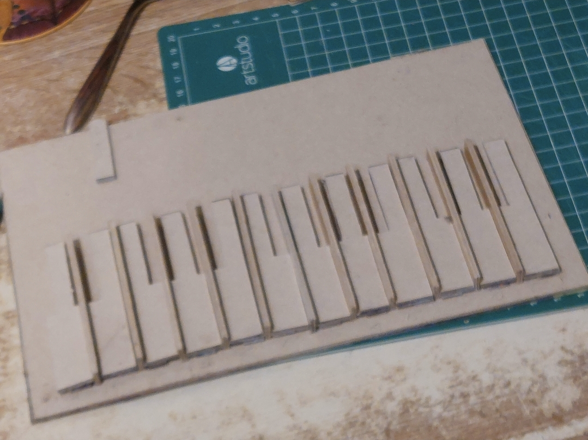
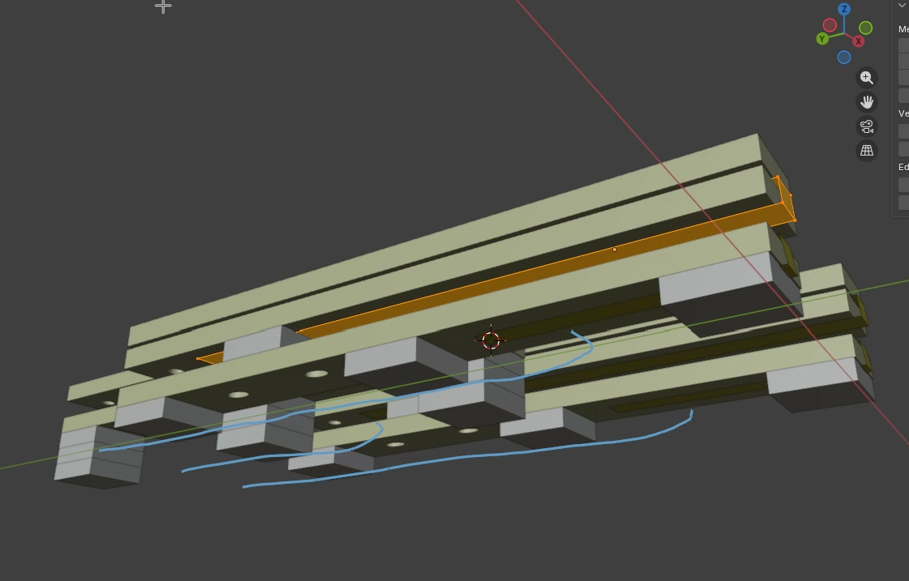
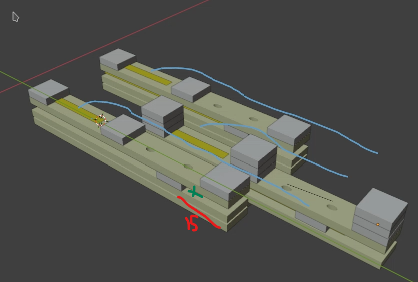

## design

cardboard cereal box keyboard. 

this is the 4th homemade keyboard instrument. 

and another work in progress. 

the first (branch keyboard1) did work but the rubber bands atrophied quickly and needed to be replaced. this was a problem when the rest of the assembly was superglued and given the rate of disintegration. an alternative rubber band could be found but the attractiveness of using something very cheap is still a draw, especially as my family seem to have them just lying around waiting to choke on.

the rubber band technique for this allow for reuse more easily

version 3b design is the bottom contact and the top contact using the rubber band technique and mounted on littke towers
wire for the bottom because the copper contact strip goes under the lower contact rather than over the top, oppositebto how the last one went

four high, 2 high, 1 high.. who knows

not sure about the spacers yet, but the heights of the spacers is 10mm and 15mm the widths are standard 9mm

this is the layout, jkeys soaced by 2.5mm. spacers may be abandoned, in favour of pegs

need to:
- sand the key bottoms
- copper tape the under untact
- stick tower legs to under contact
- draw wire guides for partial matrix
- wire / solder the under contact
- hole and rubber band the under contact
- hole the key (?) at top - where does the over wire go?

peg holes drilled, top of key contact now underneath and stops short of the hole

green cross indicates the top key contact end

*WARNING* do not stick the keys down until wire attached

