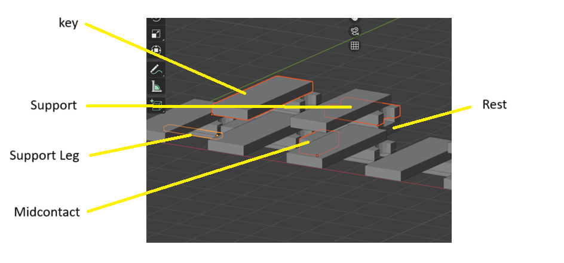
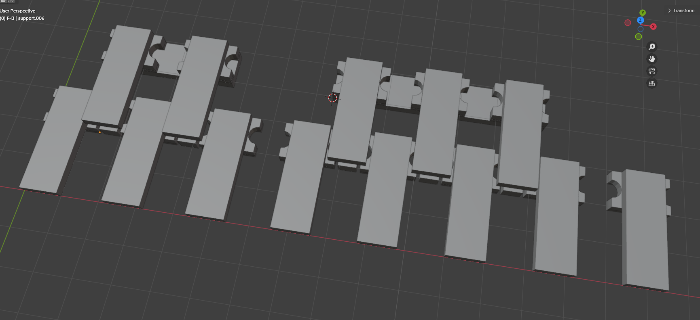
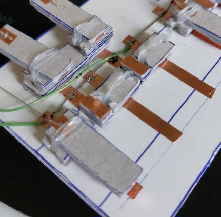
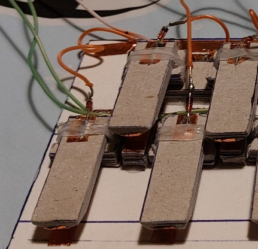
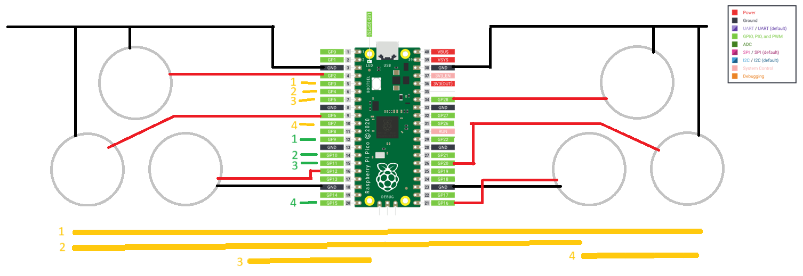

## design

cardboard cerial box keyboard. 

this is the 3rd homemade keyboard instrument. first was made from famous purple supermarket loyalty cards, the second, cardboard, was flimsier and abandoned.

keys are mechanical with rubber bands to ensure key returns to rest. copper foil tape is used as contacts to the underside of each key and curled around to the top to create a point to solder on a signal diode.

the bottom contact is (for white keys) stuck directly onto a 3ply cardboard base. the copper bases for the black keys are joined to the top of the "midcontact" pieces, down the back and out to line up with the white base contacts. the base contacts are grouped together into rows for the keyboard matrix, i.e. key bases 1-4, 5-8, 9-12 and 13 by itself. the keys 1,5,9 and 13 are joined _after_ the diode for column 1 and so on.

# picture

units are centimetres when it was made in real life.

when making, an obsessive amount of 1cm lengths were measured with a steel ruler and a biro and cut to size.

one finds a rhythm.

around the supports were wound rubber hair braiding bands. went with 3 winds but if 2 works all the better, it only needs to bring the key back to horizontal after pressing. it is a nightmare getting some of the key tops back in after soldering. also proximity to a hot soldering iron snaps them. who knew? several of the supports had to be sliced off the backing board and re-glued.

## physical parts made of cardboard 

the following list the parts needed.

for example Key is the Key top, is made of 5 pieces of cardboard cut from a fake shreddies box 1cm by 3cm for the keys C to E, 5 are needed (so  25 in all)

"ply" means layers which are superglued together

that the support pieces are half the size is convenient and deliberate 

the modelling was done after prototyping was done to better understand the assembly, but at best it helped to confirm the Rest measurements, which, because it's impossible to get all the pieces exactly the same size and layed out perfectly, are out anyway.

# keys c to e

- Key (1.0, 3.0) 5ply x 5
- Support (1.0, 1.5) 5ply x 5
- Midcontact (1.0, 0.5) 9ply x 2
- Rest (1.0, 3.7) 7ply x 1
- Support Leg (0.25, 1.5) 2ply * x 10

# keys f to b

- Key (1.0, 3.0) 5ply x 7
- Midcontact (1.0, 0.5) 9ply x 3
- Rest (1.0, 5.9) 7ply x 1
- Support (1.0, 1.5) 5ply x 7
- Support Leg (0.25, 1.5) 2ply x 14

# key c

- Key (1.0. 3.0) 5ply x 1
- Support (1.0, 1.5) 5ply x 1
- Support Leg (0.25, 1.5) 2ply x 2

# notes

*Potential 0.5x1.5 and fold

Layout white keys at 22mm intervals 

Black offset 11mm

"Rests" have been adjusted for this margin

"Midcontact" increased to help avoid rubber bands

"Support" wedges cut by hand and filed with folded sandpaper.

## wiring

# picture

6 piezo buzzers

raspberry pico (1)

a lot of wire from an old network cable, quite colourful

# pwm

2, 6, 12 (left)

16, 20, 28 (right)

# matrix

the idea is the keyboard matrix is wired in rows and columns, the row pins are all set to output and set "high", the column pins are set to input. and the matrix is "scanned".

in each scanning cycle, a row is set low, and the columns are read in turn, where a column is "on" for a given row, that switch is pressed, the row is set "high" again and the next row is done.

cols: 3, 4, 5, 7 (orange) for reading

rows: 9, 10, 11, 15 (green) for writing low

